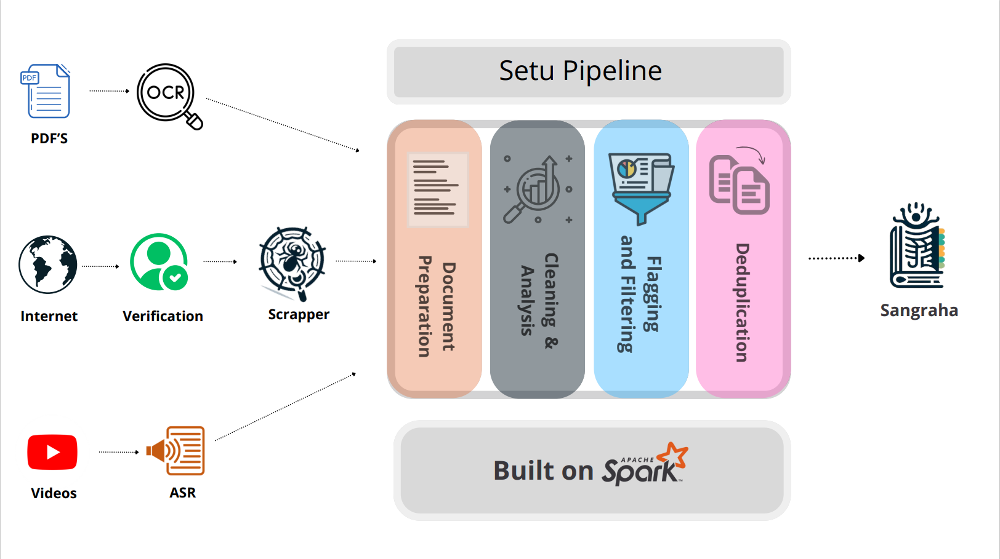

# Setu: A Comprehensive Pipeline for Data Cleaning, Filtering and Deduplication



Setu is a comprehensive pipeline designed to clean, filter, and deduplicate diverse data sources including Web, PDF, and Speech data. Built on Apache Spark, Setu encompasses four key stages: document preparation, document cleaning and analysis, flagging and filtering, and deduplication.

# Table of Contents

1. [Quickstart](#quickstart)
2. [Overview](#overview)
3. [Usage](#usage)

#### Updates :

- Added Documentation
- Flat Project Structure

#### Future Updates :

- Add support for speech transcripts
- Add support for multiple data formats

# Quickstart

This documentation provides an overview of Setu and its workflow, enabling users to efficiently manage and process Web, PDF, and Speech data with [Apache Spark](https://spark.apache.org/downloads.html).

Note that users who want to run the pipeline on Windows systems are advised to use WSL (Windows Subsystem for Linux) for easier usage. This is due to the presence of dependencies and scripts that are only usable in a Linux environment.

## Installation

### Install Python onto WSL

- Before installing make sure your Python Version is 3.10.X or above. For ease of installation we recommend using 3.10.X. Also make sure you have Miniconda installed as we will be using conda enviroments.

### Install Java OpenJDK

```bash
sudo update
sudo apt install openjdk-11-jdk
java --version
```

### Install Spark for Hadoop 3.3

Note : Ensure you do this the following in your home/user folder

```bash
wget https://dlcdn.apache.org/spark/spark-3.5.1/spark-3.5.1-bin-hadoop3.tgz
```

```bash
mkdir ~/hadoop/spark-3.3.0
tar -xvzf spark-3.3.0-bin-hadoop3.tgz -C ~/hadoop/spark-3.3.0 --strip 1
```

### Configuration

- Edit your bashrc file and add the following lines

```
export SPARK_HOME= ~/hadoop/spark-3.3.0
export PATH=$SPARK_HOME/bin:$PATH
source ~/.bashrc
```

- Copy the default spark config template and save it as config file.

```
cp $SPARK_HOME/conf/spark-defaults.conf.template $SPARK_HOME/conf/spark-defaults.conf
```

- Edit the config file and mnetion spark host address.

```
nano $SPARK_HOME/conf/spark-defaults.conf
spark.driver.host	localhost
```

- Test your spark installation by running spark-shell.

```bash
spark-shell
```

### Setu Environment Setup

You can now directly create the conda environment from the environment.yaml file provided.

```bash
conda env create -f environment.yml
```

- Refer the [packages](packages.txt) text file for verification of libraries downloaded. Some libraries need to be downloaded utilizing pip.

Make sure that Pyspark is working by running pyspark on the terminal

```bash
pyspark
```

# Overview

As part of the IndicLLMSuite : A Blueprint for Creating Pre-training and Fine-Tuning Datasets for Indian Languages we release Sangraha, a 251 billion tokens dataset summed up over 22 languages extracted from curated URLs, existing multilingual corpora, and large-scale translations.

For data corpus we utilize [webcorpus](https://github.com/AI4Bharat/webcorpus) to crawl a large collection of web URLs curated across all 22 Indic languages. For PDF documents we download Book collections from [Internet Archive](archive.org) pertaining to Indic Languages. For ease of downloading PDF files, You can refer to [Sangraha Data Download](https://github.com/AI4Bharat/sangraha-download-pipeline).

## Document Preparation

The first stage of Setu focuses on extracting text from a variety of sources to create text documents for further processing. For Web documents, Setu utilizes [trafilatura](https://trafilatura.readthedocs.io/en/latest/) (Barbaresi, 2021b) to extract text from HTML. Meanwhile, PDFs undergo a pipeline that generate OCR JSON outputs utilizing [GCP Cloud Vision SDK](https://cloud.google.com/sdk/gcloud/reference/ml/vision/detect-text-pdf). Once these JSONs are generated, Setu leverages bounding box related information to filter out pages potentially afflicted with recognition issues and noise.

## Cleaning and Analysis Stage

In the cleaning and analysis stage, Setu focuses on reducing noise within individual documents. It employs a multi-model approach for language identification, leveraging outputs from three different Language Identification Libraries:

- [IndicLID](https://github.com/AI4Bharat/IndicLID)
- [NLLB](https://huggingface.co/facebook/fasttext-language-identification)
- [Google cld3](https://github.com/google/cld3)

Various statistics such as character and word counts, NSFW word count, and n-gram repetition ratio are computed during analysis.

## Flagging and Filtering Stage

During the flagging and filtering stage, Setu applies filters based on the computed statistics. Filters include line length filters, NSFW word filters, and repetition filters, aimed at removing noisy and toxic documents.

## Deduplication Stage

The deduplication stage of Setu performs fuzzy deduplication using MinHashLSH implemented in [text-dedup](https://github.com/ChenghaoMou/text-dedup). This stage helps in identifying and eliminating duplicate documents, enhancing data cleanliness and efficiency.

# Usage

For running the different stages in setu, You can refer to the [commands](examples/commands.md) file and the also utilize the [demo](examples/demo.ipynb) to understand the usage and output of the different stages. Make sure you configure the `$USER` and `--master` to point to your user folder and corresponding spark master URL. If you choose to store your datasets in a different location make sure you modify the different path arguments for the commands accordingly.
